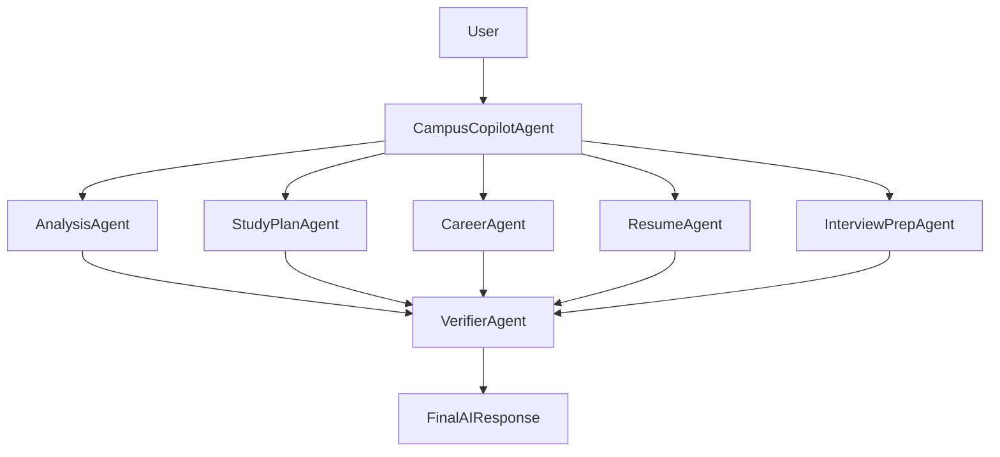
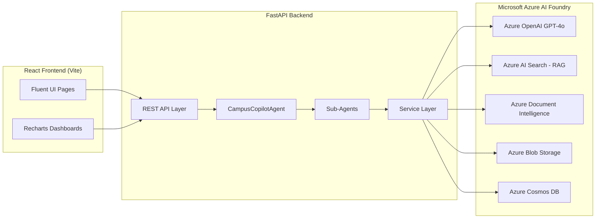
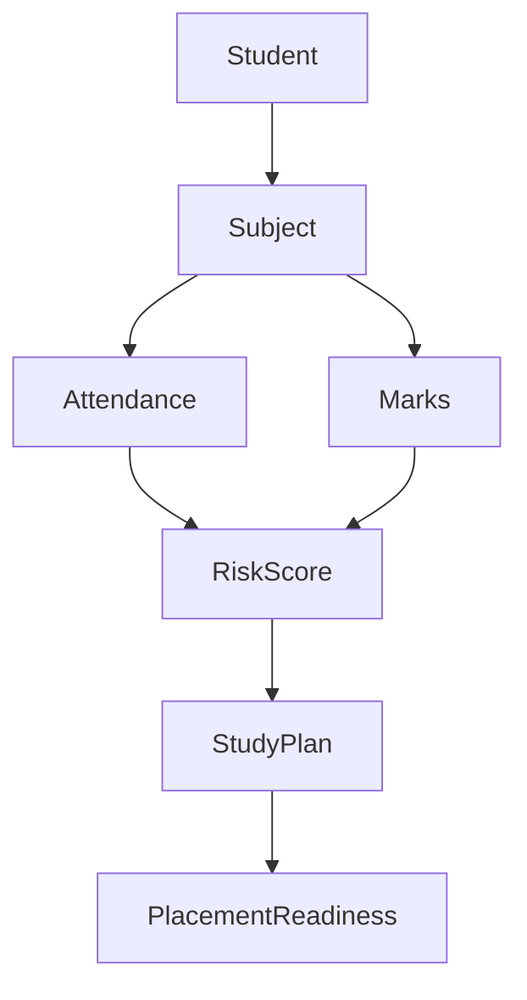

# CampusIQ X - Architecture

## 1. Multi-Agent Orchestration Flow

CampusCopilotAgent performs lightweight keyword-based intent detection on
the student's query. AnalysisAgent always runs first because its output
(risk level, weak subjects) informs the reasoning context passed to
StudyPlanAgent, CareerAgent, ResumeAgent, and InterviewPrepAgent. Every
agent's output is collected and passed to VerifierAgent, which performs
sanity/range checks, computes an overall confidence score, and synthesizes
the final natural-language response.

## 2. System Architecture

## 3. Fabric IQ Semantic Layer (Data Relationships)

## 4. Foundry IQ Knowledge Sources (RAG)

AzureAIFoundryClient.retrieve_knowledge() queries an Azure AI Search index
containing:

- Student Handbook
- Placement Guide
- Academic Policies
- Azure Learning Resources
- Certification Roadmaps

Retrieved snippets are injected as system context before each GPT-4o
reasoning call, grounding agent responses in institutional knowledge.

## 5. Work IQ Signals

Each student record includes simulated "Work IQ" signals used by the
agents for reasoning:

- Study Hours per day
- Attendance trends
- Assignment/marks completion
- Daily productivity proxy (study hours vs. CGPA trend)
- Learning activity (skills, certifications)
