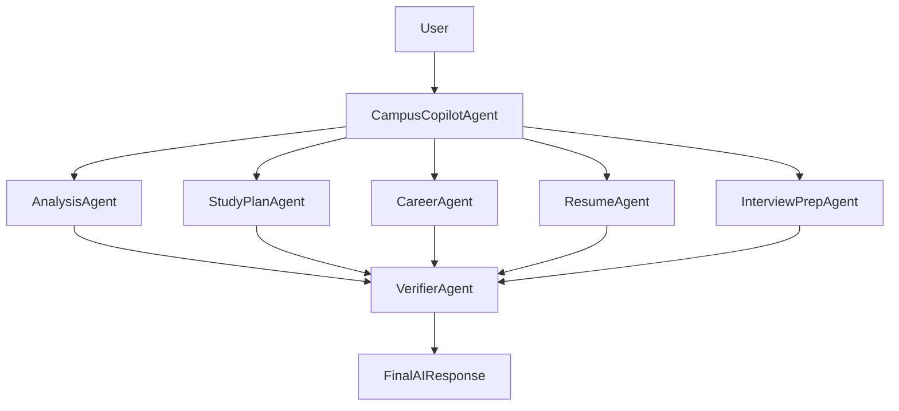

# CampusIQ X – AI Powered Academic Intelligence Platform

> Built for **Microsoft Agents League 2026 – Reasoning Agents Track**

CampusIQ X is a production-ready, enterprise-styled multi-agent AI platform
that helps students improve academic performance, reduce exam failure risk,
generate personalized study plans, boost placement readiness, analyze
resumes, prepare for technical interviews, and plan career roadmaps —
powered by **Microsoft Azure AI Foundry** (Azure OpenAI GPT-4o, Azure AI
Search, Azure AI Document Intelligence, Azure Blob Storage, Azure Cosmos DB).

---

## 1. Architecture Overview

CampusIQ X uses a **multi-agent reasoning pipeline** orchestrated by
`CampusCopilotAgent`:



See [`architecture.md`](architecture.md) for full system, data, and
knowledge-layer diagrams.

| Agent | Responsibilities |
|---|---|
| **CampusCopilotAgent** | Master orchestrator – intent detection, agent routing, response assembly |
| **AnalysisAgent** | Attendance/marks/CGPA analysis, academic risk & weak-subject detection |
| **StudyPlanAgent** | Personalized weekly study plan, revision schedule |
| **CareerAgent** | Skill gap analysis, placement readiness, career roadmap, salary prediction |
| **ResumeAgent** | Resume parsing (Azure Document Intelligence), ATS score, job match |
| **InterviewPrepAgent** | Technical & HR question generation, STAR method guidance |
| **VerifierAgent** | Validates outputs, clamps out-of-range values, computes confidence, synthesizes final response |

---

## 2. Tech Stack

**Backend:** FastAPI, Pydantic, async architecture, Python 3.12
**Frontend:** React 18 + Vite, Fluent UI v9, Recharts, Framer Motion, React Router
**AI:** Azure AI Foundry (Azure OpenAI GPT-4o), Azure AI Search (RAG), Azure
Document Intelligence, Azure Blob Storage, Azure Cosmos DB

The application runs in **demo-safe mode** with deterministic rule-based
fallbacks if Azure credentials are not configured, so it is fully
functional out of the box for local development and demos.

---

## 3. Project Structure

```
Campus-iq/
├── backend/
│   ├── main.py                  # FastAPI entrypoint
│   ├── api/routes.py            # All REST endpoints
│   ├── agents/                  # CampusCopilotAgent + 6 sub-agents
│   ├── services/                # Azure clients, repositories, analytics
│   ├── models/schemas.py        # Pydantic models
│   ├── synthetic_data/          # Dataset generator + students.json
│   ├── requirements.txt
│   ├── Dockerfile
│   └── .env.example
├── frontend/
│   ├── src/
│   │   ├── components/          # Sidebar, TopNav, StatCard, ConfidenceRing, Common
│   │   ├── pages/                # 10 pages (Dashboard, AI Chat, etc.)
│   │   ├── layouts/MainLayout.jsx
│   │   ├── context/AppContext.jsx
│   │   ├── hooks/useFetch.js
│   │   ├── services/api.js
│   │   └── theme/fluentTheme.js
│   ├── package.json
│   ├── vite.config.js
│   ├── Dockerfile
│   ├── nginx.conf
│   └── .env.example
├── docker-compose.yml
├── architecture.md
└── README.md
```

---

## 4. REST API Reference

| Method | Endpoint | Description |
|---|---|---|
| GET | `/students` | List all students (synthetic dataset) |
| GET | `/student/{id}` | Get a single student profile |
| POST | `/chat` | CampusCopilotAgent orchestration (AI Chat) |
| POST | `/studyplan` | Generate weekly study plan (StudyPlanAgent) |
| POST | `/resume/upload` | Upload & analyze resume PDF (ResumeAgent) |
| POST | `/placement/predict` | Placement readiness & career roadmap (CareerAgent) |
| POST | `/interview/questions` | Mock interview Q&A (InterviewPrepAgent) |
| GET | `/analytics` | Chart-ready cohort analytics |
| GET | `/dashboard` | Aggregated dashboard KPIs |
| GET | `/health` | Service & agent health, Azure connection status |

Interactive API docs: `http://localhost:8000/docs`

---

## 5. Running Locally

### Backend

```bash
cd backend
python -m venv .venv
source .venv/bin/activate          # Windows: .venv\Scripts\activate
pip install -r requirements.txt

# Optional: configure Azure AI Foundry credentials
cp .env.example .env

# Generate / regenerate synthetic dataset (already included)
python synthetic_data/generate_students.py

uvicorn main:app --reload --port 8000
```

Backend runs at `http://localhost:8000` (docs at `/docs`).

### Frontend

```bash
cd frontend
npm install
cp .env.example .env   # VITE_API_BASE_URL=/api (Vite proxy -> backend)
npm run dev
```

Frontend runs at `http://localhost:5173`.

---

## 6. Running with Docker Compose

```bash
docker compose up --build
```

- Frontend: `http://localhost:5173`
- Backend: `http://localhost:8000`

---

## 7. Azure AI Foundry Integration

All Azure integrations live in `backend/services/`:

- **`azure_ai_client.py`** – Azure OpenAI (GPT-4o) chat completions +
  Azure AI Search retrieval ("Foundry IQ" knowledge layer). Falls back to
  rule-based agent logic if `AZURE_OPENAI_ENDPOINT` / `AZURE_OPENAI_API_KEY`
  are not set.
- **`document_intelligence.py`** – Resume PDF text extraction via Azure AI
  Document Intelligence (`prebuilt-read`), with a local `pypdf` fallback.

To enable live AI reasoning, fill in `backend/.env` (see
`.env.example`) with your Azure AI Foundry resource credentials, then
restart the backend. The Settings page shows live connection status.

---

## 8. Deployment (Azure)

1. **Backend** → Azure App Service / Azure Container Apps (deploy the
   `backend/Dockerfile`). Set the environment variables from
   `backend/.env.example` as App Service configuration / secrets.
2. **Frontend** → Azure Static Web Apps or Azure Container Apps (deploy
   `frontend/Dockerfile`, build with
   `VITE_API_BASE_URL=https://<your-backend-app>.azurewebsites.net`).
3. **Azure AI Foundry resources**: provision an Azure OpenAI resource with
   a `gpt-4o` deployment, an Azure AI Search service (index the Student
   Handbook, Placement Guide, Academic Policies, etc. for RAG), and an
   Azure AI Document Intelligence resource for resume parsing.
4. **Azure Cosmos DB**: swap `StudentRepository` (in-memory JSON) for a
   Cosmos DB-backed repository implementing the same interface
   (`list_all`, `get_by_id`, `count`) to persist real student data.
5. **Azure Blob Storage**: store uploaded resumes via
   `AZURE_STORAGE_CONNECTION_STRING` before passing to Document
   Intelligence (recommended for audit/history).
6. **Azure Entra ID** (optional): add authentication middleware in
   `main.py` to secure the API with Entra ID tokens.
7. **Azure Monitor** (optional): enable Application Insights for agent
   telemetry (execution times are already tracked via `BaseAgent.timed`).

---

## 9. Gamification & Engagement (Roadmap)

The data model and agent outputs are designed to support gamification
features (XP, badges, levels, streaks, leaderboard) by tracking:

- `progress_tracker` from StudyPlanAgent (daily task completion)
- `confidence_score` trends across AnalysisAgent runs
- `placement_score` / `interview_score` improvements over time

These can be layered into Cosmos DB documents per student as the platform
matures beyond the synthetic dataset.

---

## 10. License

MIT License - CampusIQ 
